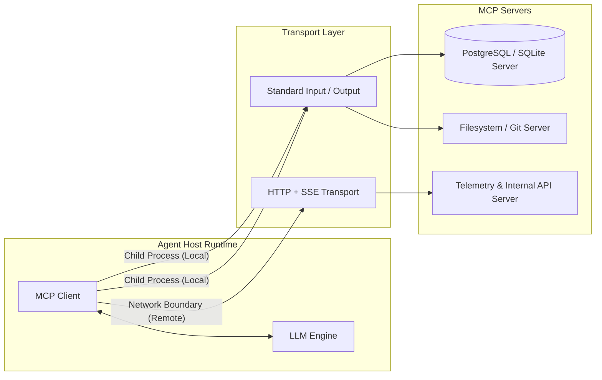

## 1. The Production Reality: Moving Beyond Fragile Toy Agents

Building a proof-of-concept AI agent takes thirty minutes: wire an LLM client to a hardcoded Python script, provide a few JSON function definitions in the prompt, and watch the model inspect mock data.

Running agentic systems in production 24/7 is a different discipline. Ad-hoc tool implementations quickly hit systemic failure modes:

* **SaaS Margin Bleed:** Proprietary orchestration platforms wrap simple API calls in opaque runtime layers, adding compounding latency and per-step platform markup on top of raw token consumption.
* **Security & Data Egress Risks:** Exposing internal databases, Git repos, or proprietary microservices to black-box cloud orchestrators forces developers to punch holes in private VPCs and share production credentials with third-party servers.
* **Brittle Interface Debt:** Every new LLM provider requires custom tool-calling adapters, bespoke serialization logic, and error-handling shims. When API schemas shift, client code breaks silently.

Production architectures require standardized interfaces, isolated process boundaries, deterministic error handling, and strict cost controls. The **Model Context Protocol (MCP)** directly solves this coupling problem by providing an open, vendor-neutral standard for connecting agentic runtimes to tools and contextual data sources.

---

## 2. Core Concepts: The "USB-C" Mental Model

Model Context Protocol (MCP) functions as a universal communication protocol between agent runtimes (**Hosts/Clients**) and capability providers (**Servers**).

Instead of writing bespoke adapters for every database, file system, or internal REST API, you write an MCP server once. Any MCP-compliant client can discover its capabilities, validate input parameters, and invoke actions over standardized transports.



### The Three MCP Primitives

1. **Tools (Actionable Executables):** Functions the model can trigger to mutate state or query external systems (e.g., `execute_sql_query`, `deploy_container`). Tools define their input arguments using JSON Schema.
2. **Resources (Contextual Data):** Read-only artifacts accessed via standard URI schemes (e.g., `db://metrics/live`, `file:///var/log/audit.log`). Resources supply background context without model-directed execution side effects.
3. **Prompts (Standardized Workflows):** Server-provided prompt templates designed to steer the LLM through specific domain operations.

### Transports: Local vs. Networked

* **stdio (Standard I/O):** The host spawns the MCP server as an isolated child process, communicating over `stdin` and `stdout`. Zero network configuration, minimal overhead, and native container isolation make this the default pattern for self-hosted single-host nodes.
* **HTTP with Server-Sent Events (SSE):** Used when the server runs on a dedicated remote host across a secure internal network. The client sends JSON-RPC requests via HTTP `POST` and listens for streaming notifications over an `SSE` stream.

---

## 3. Architectural Stack Overview

A reliable, self-hosted production deployment relies on an itemized stack with clean operational separation:

* **Infrastructure:** Minimal bare-metal VPS or isolated Linux container (Ubuntu 24.04 LTS).
* Minimum baseline: **2 vCPU, 4 GB RAM, 20 GB NVMe storage**.


* **Orchestration & Process Control:** Linux `systemd` or rootless `Podman`/`Docker` containers to enforce per-server memory limits, CPU quotas, and process auto-restart policies.
* **Model Engine / Gateway:** Self-hosted OpenAI-compatible inference endpoint (e.g., vLLM or Ollama on an internal GPU node) or a direct secure egress proxy to your foundation model provider.
* **MCP Protocol Layer:** Official Model Context Protocol SDKs (`@modelcontextprotocol/sdk` for TypeScript; `mcp` for Python).
* **Security & Boundary Isolation:** Local server execution runs under restricted unprivileged system users (`nobody` or dedicated `mcp-svc`). Strict validation on incoming JSON schemas prevents arbitrary code or SQL injection.

---

## 4. Step-by-Step Implementation

### Step 1: Environment & Directory Preparation

Run the following commands on your Linux host to initialize your project directories and install dependencies:

```bash
# Update base repositories and install system packages
sudo apt-get update && sudo apt-get install -y curl build-essential python3 python3-pip python3-venv

# Create a dedicated directory for our MCP architecture
mkdir -p /opt/mcp-agentic-stack/{ts-stack,py-stack}
cd /opt/mcp-agentic-stack

```

---

## 5. Dual Implementations: TypeScript & Python

Below are production-ready, fully functional implementations of both an **MCP Server** (exposing a system diagnostic tool and a read-only resource) and an **MCP Client Agent Loop**.

---

### Implementation A: TypeScript (Modern ESM)

#### 1. Setup & Package Configuration

Inside `/opt/mcp-agentic-stack/ts-stack`:

```bash
cd /opt/mcp-agentic-stack/ts-stack
npm init -y
npm install @modelcontextprotocol/sdk zod
npm install -D typescript @types/node tsx

```

Update `package.json` to include `"type": "module"`:

```json
{
  "name": "ts-mcp-production",
  "version": "1.0.0",
  "type": "module",
  "scripts": {
    "server": "tsx server.ts",
    "client": "tsx client.ts"
  },
  "dependencies": {
    "@modelcontextprotocol/sdk": "^1.6.0",
    "zod": "^3.23.8"
  },
  "devDependencies": {
    "@types/node": "^22.0.0",
    "tsx": "^4.19.0",
    "typescript": "^5.5.0"
  }
}

```

#### 2. MCP Server (`server.ts`)

```typescript
import { Server } from "@modelcontextprotocol/sdk/server/index.js";
import { StdioServerTransport } from "@modelcontextprotocol/sdk/server/stdio.js";
import {
  CallToolRequestSchema,
  ListToolsRequestSchema,
  ListResourcesRequestSchema,
  ReadResourceRequestSchema,
} from "@modelcontextprotocol/sdk/types.js";
import os from "node:os";

// 1. Initialize the MCP Server instance
const server = new Server(
  {
    name: "production-system-metrics-server",
    version: "1.0.0",
  },
  {
    capabilities: {
      tools: {},
      resources: {},
    },
  }
);

// 2. Expose available resources
server.setRequestHandler(ListResourcesRequestSchema, async () => {
  return {
    resources: [
      {
        uri: "system://diagnostics/specs",
        name: "Host Hardware Specifications",
        mimeType: "application/json",
        description: "Static CPU architecture and total system memory specifications.",
      },
    ],
  };
});

// 3. Handle resource content queries
server.setRequestHandler(ReadResourceRequestSchema, async (request) => {
  if (request.params.uri === "system://diagnostics/specs") {
    const specs = {
      platform: os.platform(),
      arch: os.arch(),
      cpuCores: os.cpus().length,
      totalMemoryMB: Math.round(os.totalmem() / (1024 * 1024)),
    };

    return {
      contents: [
        {
          uri: request.params.uri,
          mimeType: "application/json",
          text: JSON.stringify(specs, null, 2),
        },
      ],
    };
  }
  throw new Error(`Resource not found: ${request.params.uri}`);
});

// 4. Register tools
server.setRequestHandler(ListToolsRequestSchema, async () => {
  return {
    tools: [
      {
        name: "get_memory_usage",
        description: "Calculates current heap and system memory utilization.",
        inputSchema: {
          type: "object",
          properties: {
            includeFreeMemory: {
              type: "boolean",
              description: "Whether to include raw free memory calculations.",
            },
          },
          required: [],
        },
      },
    ],
  };
});

// 5. Handle tool execution with strict error boundaries
server.setRequestHandler(CallToolRequestSchema, async (request) => {
  const { name, arguments: args } = request.params;

  if (name === "get_memory_usage") {
    try {
      const freeMem = os.freemem();
      const totalMem = os.totalmem();
      const usedMem = totalMem - freeMem;
      const usagePercentage = ((usedMem / totalMem) * 100).toFixed(2);

      const payload: Record<string, unknown> = {
        usagePercentage: `${usagePercentage}%`,
        usedMemoryMB: Math.round(usedMem / (1024 * 1024)),
      };

      if (args && (args as { includeFreeMemory?: boolean }).includeFreeMemory) {
        payload.freeMemoryMB = Math.round(freeMem / (1024 * 1024));
      }

      return {
        content: [
          {
            type: "text",
            text: JSON.stringify(payload, null, 2),
          },
        ],
      };
    } catch (error) {
      return {
        isError: true,
        content: [
          {
            type: "text",
            text: `Failed to retrieve memory metrics: ${(error as Error).message}`,
          },
        ],
      };
    }
  }

  throw new Error(`Unrecognized tool name: ${name}`);
});

// 6. Connect via Standard Input/Output
async function run() {
  const transport = new StdioServerTransport();
  await server.connect(transport);
  process.stderr.write("TypeScript MCP Server active and running on stdio.\n");
}

run().catch((err) => {
  process.stderr.write(`Fatal error running server: ${err.message}\n`);
  process.exit(1);
});

```

#### 3. MCP Agent Client (`client.ts`)

```typescript
import { Client } from "@modelcontextprotocol/sdk/client/index.js";
import { StdioClientTransport } from "@modelcontextprotocol/sdk/client/stdio.js";

async function executeAgentWorkflow() {
  // 1. Configure the stdio transport to spawn the server process
  const transport = new StdioClientTransport({
    command: "npx",
    args: ["tsx", "server.ts"],
  });

  const client = new Client(
    {
      name: "production-agent-runner",
      version: "1.0.0",
    },
    {
      capabilities: {},
    }
  );

  await client.connect(transport);
  console.log("[Agent Host] Successfully connected to MCP Server.");

  // 2. Discover available capabilities dynamically
  const toolsResponse = await client.listTools();
  console.log(`[Agent Host] Discovered ${toolsResponse.tools.length} tool(s):`);
  for (const tool of toolsResponse.tools) {
    console.log(` - ${tool.name}: ${tool.description}`);
  }

  // 3. Execute a validated tool call
  console.log("[Agent Host] Invoking tool: get_memory_usage...");
  const result = await client.callTool({
    name: "get_memory_usage",
    arguments: { includeFreeMemory: true },
  });

  console.log("[Agent Host] Tool Result Received:");
  console.log(result.content[0].text);

  // 4. Clean shutdown of child processes
  await client.close();
  console.log("[Agent Host] Connection closed gracefully.");
}

executeAgentWorkflow().catch((err) => {
  console.error("[Agent Host] Workflow execution failed:", err);
  process.exit(1);
});

```

---

### Implementation B: Python (Python 3.11+ Asyncio)

#### 1. Setup & Environment

Inside `/opt/mcp-agentic-stack/py-stack`:

```bash
cd /opt/mcp-agentic-stack/py-stack
python3 -m venv .venv
source .venv/bin/activate
pip install --upgrade pip
pip install mcp

```

#### 2. MCP Server (`server.py`)

```python
import asyncio
import os
import sys
from mcp.server.fastmcp import FastMCP

# 1. Initialize FastMCP instance
mcp = FastMCP("Production-Python-System-Server")

# 2. Register a read-only resource
@mcp.resource("system://diagnostics/specs")
def get_system_specs() -> str:
    """Return host architecture and kernel release version."""
    return (
        f"Platform: {sys.platform}\n"
        f"Python Version: {sys.version.split()[0]}\n"
        f"PID: {os.getpid()}"
    )

# 3. Register a deterministic tool
@mcp.tool()
def compute_disk_utilization(target_path: str = "/") -> dict[str, str | int | float]:
    """Inspect disk capacity and utilization percentage for a target path."""
    try:
        stat = os.statvfs(target_path)
        block_size = stat.f_frsize
        total_blocks = stat.f_blocks
        free_blocks = stat.f_bavail

        total_bytes = block_size * total_blocks
        free_bytes = block_size * free_blocks
        used_bytes = total_bytes - free_bytes

        used_gb = round(used_bytes / (1024**3), 2)
        total_gb = round(total_bytes / (1024**3), 2)
        percentage = round((used_bytes / total_bytes) * 100, 2)

        return {
            "path": target_path,
            "total_gb": total_gb,
            "used_gb": used_gb,
            "utilization_percent": f"{percentage}%",
        }
    except Exception as exc:
        return {"error": f"Failed to calculate disk usage: {str(exc)}"}

if __name__ == "__main__":
    # FastMCP uses standard input/output transport by default
    mcp.run(transport="stdio")

```

#### 3. MCP Agent Client (`client.py`)

```python
import asyncio
import json
import sys
from mcp import ClientSession, StdioServerParameters
from mcp.client.stdio import stdio_client

async def run_client_workflow():
    # 1. Configure the server startup parameters
    server_params = StdioServerParameters(
        command=sys.executable,
        args=["server.py"],
        env=None
    )

    print("[Python Agent] Spawning child MCP server process...")
    async with stdio_client(server_params) as (read, write):
        async with ClientSession(read, write) as session:
            # 2. Initialize protocol handshake
            await session.initialize()
            print("[Python Agent] Handshake established.")

            # 3. Discover available tools
            tools_list = await session.list_tools()
            print(f"[Python Agent] Found {len(tools_list.tools)} tool(s):")
            for tool in tools_list.tools:
                print(f" - {tool.name}: {tool.description}")

            # 4. Invoke a specific tool
            print("[Python Agent] Calling 'compute_disk_utilization' for '/'...")
            response = await session.call_tool(
                name="compute_disk_utilization",
                arguments={"target_path": "/"}
            )

            print("[Python Agent] Raw output received from server:")
            for item in response.content:
                if hasattr(item, "text"):
                    print(item.text)

if __name__ == "__main__":
    asyncio.run(run_client_workflow())

```

---

## 6. Production Hardening: Systemd Service Isolation

In production environments, never launch server scripts interactively inside user terminals. Run network-facing MCP endpoints or persistent background workers under Linux `systemd` to enforce cgroups quotas and automatic restarts.

Create `/etc/systemd/system/mcp-server.service`:

```ini
[Unit]
Description=Production Model Context Protocol Microservice
After=network.target

[Service]
Type=simple
User=nobody
Group=nogroup
WorkingDirectory=/opt/mcp-agentic-stack/ts-stack
ExecStart=/usr/bin/node /opt/mcp-agentic-stack/ts-stack/dist/server.js
Restart=always
RestartSec=5s

# Production Resource & Security Governance
MemoryMax=512M
CPUQuota=50%
NoNewPrivileges=true
ProtectSystem=strict
ProtectHome=true
PrivateTmp=true

[Install]
WantedBy=multi-user.target

```

Enable and verify the service:

```bash
sudo systemctl daemon-reload
sudo systemctl enable --now mcp-server.service
sudo systemctl status mcp-server.service

```

---

## 7. Production FAQ

### How do we handle process zombies and memory leaks with stdio servers running 24/7?

In stdio architectures, the host client acts as the parent process. If the client terminates unexpectedly, child processes can become orphaned zombies.

To mitigate this:

1. Always catch parent termination signals (`SIGINT`, `SIGTERM`) to clean up child pipes.
2. Implement explicit health-check timeouts: if an MCP server fails to respond to a ping or tool call within a strict deadline (e.g., 10 seconds), kill and respawn the subprocess.
3. Use Linux cgroups or `MemoryMax` settings in systemd/Docker to prevent uncontrolled memory ballooning.

### What prevents an agent from executing dangerous inputs via an MCP tool?

The model itself does not execute code; the MCP server does. Never expose arbitrary shell execution tools (`eval`, `sh -c`) to an autonomous model.

Instead, construct constrained, domain-specific tools with narrow schemas. Validate all incoming parameters against strict Zod or Pydantic schemas before running backend logic. Sanitize paths against directory traversal attacks (`path.resolve` checks) and use parameterized queries for all database drivers.

### When should teams choose stdio over HTTP + SSE?

* **Use stdio when:** The tools, agent runtime, and host live on the same physical host or inside the same container pod. It eliminates authentication management overhead, networking hops, and TLS configuration.
* **Use HTTP + SSE when:** Different engineering teams manage specialized tool servers across distributed infrastructure, or when multiple agent instances need to share access to a centralized, stateful MCP tool server behind an internal reverse proxy.

### How do we prevent infinite execution loops during agentic workflows?

Autonomous agents can enter repetitive retry cycles if a tool returns an ambiguous error. Enforce three boundaries inside the agent loop:

1. **Maximum Step Count:** Hard-cap total tool executions per request (e.g., maximum 5 iterations).
2. **Token & Budget Caps:** Stop execution if cumulative prompt and completion tokens exceed your predetermined ceiling.
3. **Repeated Argument Detection:** If an agent attempts to invoke the exact same tool with identical arguments consecutively, interrupt the loop and return a graceful fallback response to the user.