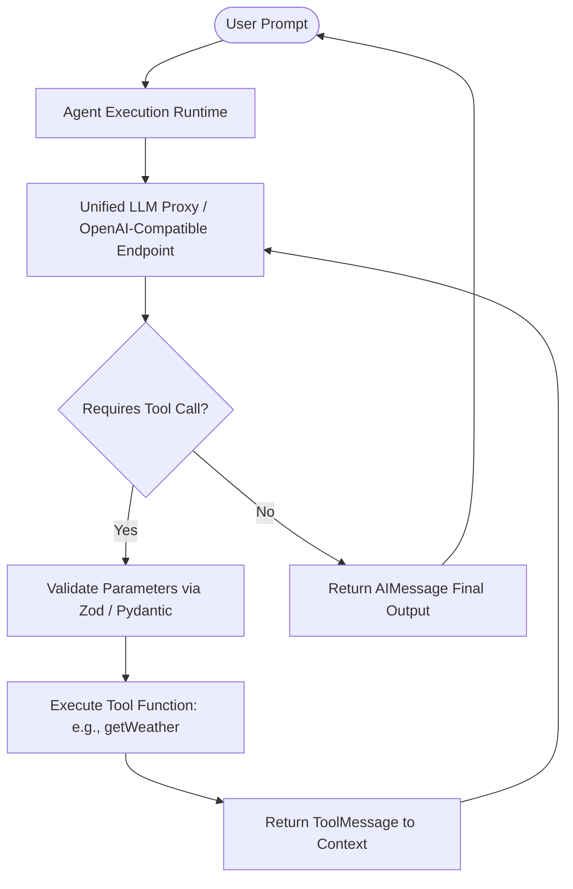

Based on the technical walkthrough in [LangChain TypeScript for Beginners: Live Unedited Training & Real Bug Fixes](https://www.youtube.com/watch?v=hUrtQFY0Xds), this article deconstructs how to construct single-agent workflows without getting trapped by fragile abstractions or mounting cloud token costs.



---

## Hook & Problem Space

Most introductory tutorials for AI agents suffer from two recurring flaws:

1. **The Python Monopoly:** Almost every online tutorial relies solely on Python scripts. Full-stack architects and backend engineers building interactive web portals, event-driven microservices, or React/Next.js frontends must integrate agents directly into Node.js and TypeScript ecosystems.
2. **The Cloud Trap:** Relying on proprietary SaaS APIs for rapid prototyping quickly balloons development costs. Running local open-weight models via Ollama requires substantial dedicated hardware (minimum 16GB RAM for low-parameter models).

In production 24/7 reality, unmonitored agent loops risk runaway token consumption, silent model crashes, and schema misalignment. Real-world systems require:

* Decoupled model providers using standardized OpenAI-compatible Base URL proxies.
* Resilient tool contracts backed by schema validation (Zod in TypeScript, Pydantic in Python).
* Deterministic response parsing that handles asynchronous promises and multi-turn message arrays.

---

## Core Concepts Made Simple

To build reliable agents, developers need a firm grasp of four architectural layers:

1. **The Chat Model Connector:** Standardized interfaces (such as `@langchain/openai` or `ChatOpenAI`) establish connections via two parameters: `baseURL` and `apiKey`. Pointing these to a unified proxy or local gateway enables swapping between Gemini, Groq, or self-hosted models without altering business logic.
2. **Tool Calling Contracts:** A tool is an executable function paired with a strict schema. The LLM does not execute code directly; it outputs structured JSON arguments adhering to the schema.
3. **The Agent Runtime Loop:** The agent continuously evaluates the conversation history:
* If the LLM requests a tool call, the agent pauses generation, executes the local function, appends a `ToolMessage` with the result, and calls the model again.
* When no more tool calls are requested, it outputs the final `AIMessage`.


4. **Message Array Parsing:** Multi-turn tool execution produces a history containing `SystemMessage`, `HumanMessage`, `AIMessage` (with tool calls), `ToolMessage`, and the closing `AIMessage`. Reliable extraction reads from the tail (`messages[messages.length - 1]`).

---

## Architectural Stack Overview

* **Infrastructure:** Local development workstation or Linux VPS (minimum 2 vCPU, 4GB RAM for proxy routing; 16GB+ RAM if running local Ollama inference).
* **Orchestration:** LangChain Core agent runner with ES Module (`type: "module"`) execution.
* **Engine / Gateway:** Unified LLM proxy routing OpenAI-compatible endpoints (`/v1/chat/completions`) across models that explicitly support function calling.
* **Security & Schema Validation:** Strict runtime parameter validation using Zod (TypeScript) and Pydantic (Python) to prevent prompt injection and malformed parameter errors.

---

## Step-by-Step Implementation

### Environment Prerequisites

Verify Node.js (v20+ LTS recommended) and Python (3.11+):

```bash
node -v
npm -v
python3 --version

```

### TypeScript Project Setup

```bash
mkdir langchain-ts-agent && cd langchain-ts-agent
npm init -y

# Configure ES Modules in package.json
npm pkg set type="module"

# Install LangChain Core, OpenAI Connector, and Zod
npm install @langchain/core @langchain/openai langchain zod dotenv

```

Hardware allocation recommendation:

* **vCPU:** 2 Cores
* **RAM:** 2 GB (Node.js runtime + proxy connection)
* **Disk:** 1 GB free storage

---

## Dual Implementations

### 1. TypeScript Implementation (`src/agent.ts`)

Key failure points addressed:

* Explicit `.js` extension handling for Node.js native ES modules.
* Proper `await` handling to prevent unresolved promises on `agent.invoke()`.
* Explicit error handling for models lacking native tool-calling capabilities.

```typescript
import { ChatOpenAI } from "@langchain/openai";
import { createReactAgent } from "@langchain/langgraph/prebuilt";
import { tool } from "@langchain/core/tools";
import { z } from "zod";
import * as dotenv from "dotenv";

dotenv.config();

// 1. Define Tool Schema and Function
const weatherSchema = z.object({
  city: z.string().describe("The name of the city to retrieve weather for"),
});

const getWeatherTool = tool(
  async ({ city }: { city: string }) => {
    // Production integration: Call external weather API
    // Fallback deterministic mock for pipeline verification
    return JSON.stringify({
      city,
      condition: "Sunny",
      temperature: "32°C",
      humidity: "65%",
    });
  },
  {
    name: "get_weather",
    description: "Fetches current real-time weather information for a specified city.",
    schema: weatherSchema,
  }
);

// 2. Initialize Model Connector via OpenAI-Compatible Base URL
const model = new ChatOpenAI({
  modelName: process.env.MODEL_NAME || "gemini-1.5-flash",
  temperature: 0.2,
  configuration: {
    baseURL: process.env.LLM_BASE_URL || "http://localhost:8080/v1",
    apiKey: process.env.LLM_API_KEY || "dummy-local-key",
  },
});

// 3. Initialize Agent Runtime with System Prompt Persona
async function runAgent(prompt: string): Promise<string> {
  const tools = [getWeatherTool];
  const agent = createReactAgent({
    llm: model,
    tools,
  });

  const response = await agent.invoke({
    messages: [
      {
        role: "system",
        content: "You are an accurate, professional weather broadcaster. Present data clearly.",
      },
      {
        role: "user",
        content: prompt,
      },
    ],
  });

  // Extract the latest AI message from the conversation trail
  const messages = response.messages;
  const lastMessage = messages[messages.length - 1];

  return typeof lastMessage.content === "string"
    ? lastMessage.content
    : JSON.stringify(lastMessage.content);
}

// Execution block
(async () => {
  try {
    const result = await runAgent("What is the current weather in Kolkata?");
    console.log("\n[Agent Output]:\n" + result);
  } catch (error) {
    console.error("[Runtime Error]:", error);
    process.exit(1);
  }
})();

```

---

### 2. Python Implementation (`agent.py`)

```python
import os
import json
from typing import Dict, Any
from pydantic import BaseModel, Field
from langchain_core.tools import tool
from langchain_openai import ChatOpenAI
from langgraph.prebuilt import create_react_agent

# 1. Define Tool Schema and Function
class WeatherInput(BaseModel):
    city: str = Field(description="The name of the city to retrieve weather for")

@tool("get_weather", args_schema=WeatherInput)
def get_weather(city: str) -> str:
    """Fetches current real-time weather information for a specified city."""
    return json.dumps({
        "city": city,
        "condition": "Sunny",
        "temperature": "32°C",
        "humidity": "65%",
    })

# 2. Initialize Model Connector via OpenAI-Compatible Base URL
llm = ChatOpenAI(
    model=os.getenv("MODEL_NAME", "gemini-1.5-flash"),
    temperature=0.2,
    base_url=os.getenv("LLM_BASE_URL", "http://localhost:8080/v1"),
    api_key=os.getenv("LLM_API_KEY", "dummy-local-key"),
)

# 3. Initialize Agent Runtime
def run_agent(prompt: str) -> str:
    tools = [get_weather]
    agent = create_react_agent(model=llm, tools=tools)

    inputs = {
        "messages": [
            ("system", "You are an accurate, professional weather broadcaster. Present data clearly."),
            ("user", prompt),
        ]
    }

    response = agent.invoke(inputs)
    messages = response.get("messages", [])
    if not messages:
        return "No response generated."

    last_message = messages[-1]
    return str(last_message.content)

if __name__ == "__main__":
    try:
        output = run_agent("What is the current weather in Kolkata?")
        print("\n[Agent Output]:\n" + output)
    except Exception as err:
        print(f"[Runtime Error]: {err}")
        exit(1)

```

---

## Production FAQ

### 1. Why does the agent return `[Promise]` instead of text in TypeScript?

In Node.js asynchronous programming, calling `agent.invoke()` returns a `Promise`. Forgetting `await` causes console logs to output `Promise { <pending> }`. Always prefix asynchronous calls with `await` within an async function context or top-level ES module scope.

### 2. How do you resolve `Tool calling not supported` errors?

Not all open-weight or free LLMs have fine-tuned support for function calling. If a model only supports text generation, passing a `tools` array triggers validation rejections or silent loops. Ensure the upstream model specifically advertises function calling (e.g., Gemini 1.5, GPT-4o-mini, Mistral-Instruct, or Groq-hosted Llama-3-Tool-Use variants).

### 3. How do you prevent Node.js ES module import errors (`ERR_MODULE_NOT_FOUND`)?

When `"type": "module"` is configured in `package.json`, Node's native module loader requires explicit file extensions for local relative paths (e.g., `import { model } from "./model.js";` instead of `"./model"`). Ensure build systems (`tsc`, `esbuild`, or `tsx`) match your runtime import specifier strategy.

### 4. How should memory and state be isolated across concurrent users?

Do not store conversational state in global in-memory variables. For production deployments with multiple concurrent sessions, pass a thread/session identifier to LangGraph memory checkpointers (such as Redis or PostgreSQL checkpointers) to keep customer conversation histories isolated and prevent context bleed.

---

## Level Up Your AI Engineering & DevOps Architecture

Transitioning from toy prototypes to resilient, cost-effective production systems requires deep, hands-on experience across backend engineering, cloud infrastructure, and modern AI toolchains.

If you are an engineer, technical lead, or startup founder looking to build sovereign, production-grade systems, explore my 1-to-1 live mentoring and interactive courses at [shibajidebnath.com/courses](https://shibajidebnath.com/courses/):

* **[Master Agentic AI: MCP, ACP, & Autonomous Systems](https://shibajidebnath.com/courses/):**  
  Deepen your practical knowledge of Model Context Protocol (MCP), agent frameworks, tool-use orchestration, and private model integration in enterprise applications. *(40 Hours • Online Live Mentoring)*

* **[Master in DevOps & Infrastructure Automation](https://shibajidebnath.com/courses/):**  
  Master containerization, systemd process supervision, reverse proxy gateway architectures (Nginx/Caddy), VPC network boundaries, and high-availability deployment pipelines. *(40 Hours • Online Live Mentoring)*

* **[Master in Artificial Intelligence & Local LLMs](https://shibajidebnath.com/courses/):**  
  Learn model quantization, local inference pipelines, KV cache tuning, RAG patterns, and vector database architectures for real-world workloads. *(40 Hours • Online Live Mentoring)*

* **[Master in Python & High-Performance Backends](https://shibajidebnath.com/courses/):**  
  Build high-throughput data processing scripts, typed asynchronous APIs, and resilient microservices capable of driving AI workloads. *(40 Hours • Online Live Mentoring)*

* **[Master in Node.js, Express & Microservices](https://shibajidebnath.com/courses/):**  
  Architect robust TypeScript backend runtimes, manage connection lifecycles, and integrate streaming LLM responses directly into full-stack web applications. *(40 Hours • Online Live Mentoring)*

👉 **Explore all personalized 1-on-1 courses and syllabus breakdowns:** [Browse All Courses & Mentorship Programs](https://shibajidebnath.com/courses/)