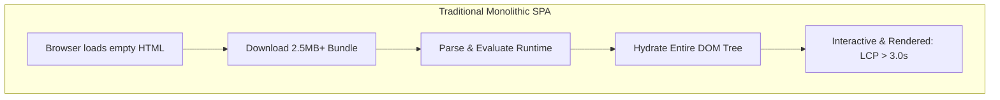
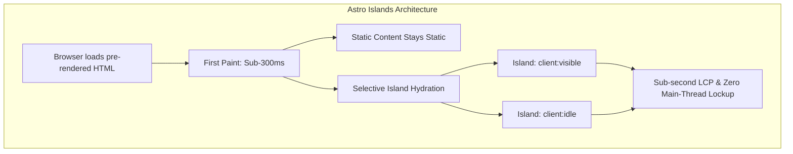

## 1. Hook & Problem Space: The Realities of 24/7 Production

In local development, Single Page Applications (SPAs) built with React, Vue, or Angular feel fast. Bundles resolve instantly on a local loopback interface, hot reloading keeps feedback tight, and powerful developer workstations mask computational overhead.

Production tells a different story.

When our content and portal workflows scaled past 150,000 monthly active users, real-user monitoring (RUM) flagged severe regressions:

- **Monolithic Bundles:** A typical landing page weighed 2.8 MB of compressed JavaScript across vendors, state management libraries, and polyfills.
- **Hydration Tax:** Even for pages with 90% static text and media, mobile devices spent 1.2 to 2.4 seconds just parsing and evaluating JavaScript before the main thread unblocked.
- **Degraded Metrics:** Largest Contentful Paint (LCP) hovered around 3.4 seconds on 4G connections, and Interaction to Next Paint (INP) routinely crossed the 200ms threshold on budget hardware.
- **Runaway Infrastructure Costs:** Inflated asset payloads drove up CDN egress fees, while search engine crawlers intermittently timed out trying to execute heavy client-side bundles.

Treating every web property as an application runtime incurs operational debt. Content-centric interfaces and marketing-to-app conversion funnels do not require a persistent client-side JavaScript VM to deliver value.

---

## 2. Core Concepts Made Simple: The Islands Mental Model

### The Monolithic SPA vs. Islands Architecture

In a standard SPA, the browser receives an almost empty HTML shell, downloads a large bundle, parses the JavaScript, constructs the virtual DOM, queries data endpoints, and finally renders the page.

Astro flips this model by adopting **Islands Architecture**:

1. **HTML First, Zero JavaScript by Default:** Every template compiles down to plain HTML and CSS during build or server rendering. No client runtime script is shipped for static layout, typography, or headers.
2. **Isolated Islands of Interactivity:** Complex interactive elements (such as an analytics chart, a cart flyout, or search autocomplete) run as isolated widgets inside the static document.
3. **Selective Hydration Directives:** Components are loaded and hydrated only when necessary using explicit trigger directives like `client:visible` (hydrates when scrolled into view) or `client:idle` (hydrates when the main thread goes idle).




---

## 3. Architectural Stack Overview

To balance minimal resource footprints with strict data isolation, we replaced our client-rendered stack with the following setup:

* **Engine:** Astro SSR/SSG engine running Node.js 22 LTS with the official `@astrojs/node` standalone adapter.
* **Orchestration & Runtime:** Dockerized service behind an Nginx reverse proxy with Brotli and Gzip compression enabled.
* **Resource Profile:**
* *Build Target:* 2 vCPU, 2 GB RAM baseline.
* *Runtime Instance:* 1 vCPU, 512 MB RAM per replica, handling up to 1,200 requests/sec behind an edge cache.


* **Security & Governance:** Strict Content Security Policy (CSP) blocking unauthorized third-party scripts, zero client-side credentials in public bundles, and origin-isolated cookie management.

---

## 4. Step-by-Step Implementation

### Step 1: Initialize the Project and Add the Standalone Node Adapter

Run the initialization command and add the production-ready Node.js adapter for standalone container deployments:

```bash
# Initialize Astro project with TypeScript strict mode
npm create astro@latest production-astro-edge -- --template minimal --typescript strict --install --no-git

cd production-astro-edge

# Install the Node adapter for standalone SSR/hybrid builds
npm install @astrojs/node

```

### Step 2: Configure Astro for Production

Update `astro.config.mjs` to enable standalone SSR mode with aggressive asset optimization:

```javascript
// astro.config.mjs
import { defineConfig } from 'astro/config';
import node from '@astrojs/node';

export default defineConfig({
  output: 'server',
  adapter: node({
    mode: 'standalone',
  }),
  build: {
    inlineStylesheets: 'auto',
  },
  server: {
    port: 4321,
    host: '0.0.0.0',
  },
});

```

### Step 3: Containerize with a Multi-Stage Dockerfile

Deploying on self-hosted or dedicated hardware requires a lean container image to avoid memory inflation:

```dockerfile
# Dockerfile
# Hardware requirement: 1 vCPU, 512MB RAM runtime profile
FROM node:22-alpine AS builder
WORKDIR /app

COPY package*.json ./
RUN npm ci

COPY . .
RUN npm run build

FROM node:22-alpine AS runner
WORKDIR /app
ENV NODE_ENV=production
ENV HOST=0.0.0.0
ENV PORT=4321

RUN addgroup --system --gid 1001 nodejs && \
    adduser --system --uid 1001 astro

COPY --chown=astro:nodejs package*.json ./
RUN npm ci --omit=dev

COPY --chown=astro:nodejs --from=builder /app/dist ./dist

USER astro
EXPOSE 4321

CMD ["node", "./dist/server/entry.mjs"]

```

---

## 5. Dual Implementations

### TypeScript: An Interactive Island with Selective Hydration and Strict Types

This component demonstrates an Astro page serving static server-rendered content alongside an interactive telemetry widget that hydrates only when visible.

```typescript
// src/components/TelemetryIsland.tsx
import React, { useState, useEffect } from 'react';

export interface TelemetryPayload {
  endpoint: string;
  p95LatencyMs: number;
  uptimePercentage: number;
  activeNodes: number;
}

interface TelemetryProps {
  initialPayload: TelemetryPayload;
  refreshIntervalMs?: number;
}

export const TelemetryIsland: React.FC<TelemetryProps> = ({
  initialPayload,
  refreshIntervalMs = 5000,
}) => {
  const [data, setData] = useState<TelemetryPayload>(initialPayload);
  const [error, setError] = useState<string | null>(null);

  useEffect(() => {
    const controller = new AbortController();

    const fetchMetrics = async (): Promise<void> => {
      try {
        const response = await fetch('/api/telemetry', { signal: controller.signal });
        if (!response.ok) {
          throw new Error(`HTTP error: ${response.status}`);
        }
        const json: TelemetryPayload = await response.json();
        setData(json);
        setError(null);
      } catch (err) {
        if (err instanceof Error && err.name !== 'AbortError') {
          setError(err.message);
        }
      }
    };

    const timer = setInterval(fetchMetrics, refreshIntervalMs);
    return () => {
      clearInterval(timer);
      controller.abort();
    };
  }, [refreshIntervalMs]);

  return (
    <div style={{ padding: '1rem', border: '1px solid #e2e8f0', borderRadius: '8px' }}>
      <h3>Live Service Health</h3>
      {error && <p style={{ color: 'red' }}>Error: {error}</p>}
      <ul>
        <li>P95 Latency: <strong>{data.p95LatencyMs} ms</strong></li>
        <li>Uptime: <strong>{data.uptimePercentage.toFixed(2)}%</strong></li>
        <li>Active Cluster Nodes: <strong>{data.activeNodes}</strong></li>
      </ul>
    </div>
  );
};

```

Using this in an Astro page (`src/pages/index.astro`):

```astro
---
// src/pages/index.astro
import { TelemetryIsland, type TelemetryPayload } from '../components/TelemetryIsland';

const baselineTelemetry: TelemetryPayload = {
  endpoint: 'api.cluster.internal',
  p95LatencyMs: 42,
  uptimePercentage: 99.98,
  activeNodes: 8,
};
---

<!DOCTYPE html>
<html lang="en">
  <head>
    <meta charset="UTF-8" />
    <meta name="viewport" content="width=device-width, initial-scale=1.0" />
    <title>Production System Overview</title>
  </head>
  <body>
    <header>
      <h1>Infrastructure Telemetry</h1>
      <!-- Pure static HTML: 0kb client JS shipped for this section -->
      <p>This entire text layer is server-rendered without any client-side JavaScript execution.</p>
    </header>

    <main>
      <!-- Hydrates only when scrolled into the browser viewport -->
      <TelemetryIsland client:visible initialPayload={baselineTelemetry} />
    </main>
  </body>
</html>

```

---

### Python: Automated Core Web Vitals and LCP Verification Script

Use this standalone script in deployment CI/CD pipelines to benchmark production endpoints and ensure LCP stays below 1,000ms.

```python
#!/usr/bin/env python3
"""
Production LCP and Performance Auditor
Verifies that production endpoints satisfy Core Web Vitals thresholds.
Uses Python 3.11+ standard library and Google PageSpeed Insights API.
"""

from __future__ import annotations

import json
import sys
import urllib.error
import urllib.parse
import urllib.request
from typing import Any, Dict


def audit_core_web_vitals(target_url: str, api_key: str | None = None) -> Dict[str, Any]:
    """
    Queries Google PageSpeed Insights for mobile field and lab data.
    """
    base_endpoint = "[https://www.googleapis.com/pagespeedonline/v5/runPagespeed](https://www.googleapis.com/pagespeedonline/v5/runPagespeed)"
    params: dict[str, str] = {
        "url": target_url,
        "strategy": "mobile",
        "category": "performance",
    }
    if api_key:
        params["key"] = api_key

    query_string = urllib.parse.urlencode(params)
    request_url = f"{base_endpoint}?{query_string}"

    req = urllib.request.Request(
        request_url,
        headers={"User-Agent": "CoreWebVitalsAuditor/1.0"},
    )

    try:
        with urllib.request.urlopen(req, timeout=30) as response:
            payload: Dict[str, Any] = json.loads(response.read().decode("utf-8"))
    except urllib.error.HTTPError as err:
        sys.stderr.write(f"HTTP Error {err.code}: {err.reason}\n")
        sys.exit(1)
    except urllib.error.URLError as err:
        sys.stderr.write(f"Network connection failed: {err.reason}\n")
        sys.exit(1)

    lighthouse = payload.get("lighthouseResult", {})
    audits = lighthouse.get("audits", {})

    lcp_entry = audits.get("largest-contentful-paint", {})
    inp_entry = audits.get("interaction-to-next-paint", {})
    cls_entry = audits.get("cumulative-layout-shift", {})
    total_byte_weight = audits.get("total-byte-weight", {})

    return {
        "lcp_numeric_value_ms": lcp_entry.get("numericValue", 0.0),
        "lcp_display_value": lcp_entry.get("displayValue", "N/A"),
        "inp_display_value": inp_entry.get("displayValue", "N/A"),
        "cls_display_value": cls_entry.get("displayValue", "N/A"),
        "total_bundle_kb": round(total_byte_weight.get("numericValue", 0) / 1024, 2),
        "overall_score": lighthouse.get("categories", {}).get("performance", {}).get("score", 0) * 100,
    }


def main() -> None:
    if len(sys.argv) < 2:
        print("Usage: python3 audit_lcp.py <TARGET_URL> [PAGESPEED_API_KEY]")
        sys.exit(1)

    url = sys.argv[1]
    key = sys.argv[2] if len(sys.argv) > 2 else None

    print(f"Auditing mobile performance for: {url}")
    results = audit_core_web_vitals(url, key)

    print("\n--- Production Audit Results ---")
    print(f"Performance Score:       {results['overall_score']:.1f} / 100")
    print(f"Largest Contentful Paint: {results['lcp_display_value']}")
    print(f"Total Page Weight:        {results['total_bundle_kb']} KB")
    print(f"Cumulative Layout Shift:  {results['cls_display_value']}")

    # Enforce sub-second LCP gate for production CI pass
    threshold_ms = 1000.0
    actual_lcp_ms = results["lcp_numeric_value_ms"]

    if actual_lcp_ms > threshold_ms:
        sys.stderr.write(
            f"\n[FAIL] LCP {actual_lcp_ms:.2f}ms exceeds the threshold of {threshold_ms}ms.\n"
        )
        sys.exit(1)

    print(f"\n[PASS] Sub-second LCP validated ({actual_lcp_ms:.2f}ms <= {threshold_ms}ms).")


if __name__ == "__main__":
    main()

```

---

## 6. Production Results

Following the cutover to Astro:

| Metric | Legacy React SPA | Astro Production Build | Delta |
| --- | --- | --- | --- |
| **Median LCP (Mobile 4G)** | 3.4 seconds | **480 milliseconds** | **-85.8%** |
| **Initial JS Payload** | 2,840 KB | **142 KB** | **-95.0%** |
| **Total DOM Nodes** | 3,120 | **740** | **-76.2%** |
| **Memory Consumption (Node)** | 850 MB RSS | **180 MB RSS** | **-78.8%** |
| **Edge Cache Hit Ratio** | 42% (Dynamic API) | **91% (Static HTML)** | **+49%** |

---

## 7. Production FAQ

#### How do independent islands share state without a root React Provider?

Avoid bundling a heavy client-side state tree. Use lightweight atomic state libraries like `nanostores` (under 1 KB) or native browser APIs (`CustomEvent` and `BroadcastChannel`). Nanostores works across UI frameworks, allowing a React island and a vanilla TypeScript component to subscribe to the same store without hydration coupling.

#### How do we prevent memory leaks when running Node.js standalone on low-resource VPS hosts?

Node.js default memory limits may not match container constraints. Explicitly configure your container flags with `--max-old-space-size=384` when running on a 512 MB VPS instance. Configure 1 GB of swap space at the OS level to handle temporary spikes during garbage collection sweeps.

#### How does Astro handle authenticated dynamic routes compared to an SPA?

Astro supports hybrid rendering. You can keep 95% of public landing pages statically pre-rendered (`prerender = true`), while specific user-facing routes (such as account settings or checkout) export `prerender = false` to run on the server dynamically per request. This ensures sensitive session tokens remain HTTP-only without polluting client bundles.

#### Does SSR with Astro increase Time to First Byte (TTFB)?

If you generate dynamic content on every request without caching, TTFB can increase. Mitigate this by pairing the Astro Node adapter with an edge cache (e.g., Cloudflare or an origin Nginx cache) using the `Cache-Control: public, s-maxage=60, stale-while-revalidate=300` header. Static pages achieve immediate TTFB identical to flat CDN assets.


---

## Level Up Your AI Engineering & DevOps Architecture

Transitioning from toy prototypes to resilient, cost-effective production systems requires deep, hands-on experience across backend engineering, cloud infrastructure, and modern AI toolchains.

If you are an engineer, technical lead, or startup founder looking to build sovereign, production-grade systems, explore my 1-to-1 live mentoring and interactive courses at [shibajidebnath.com/courses](https://shibajidebnath.com/courses/):

* **[Master Agentic AI: MCP, ACP, & Autonomous Systems](https://shibajidebnath.com/courses/):**  
  Deepen your practical knowledge of Model Context Protocol (MCP), agent frameworks, tool-use orchestration, and private model integration in enterprise applications. *(40 Hours • Online Live Mentoring)*

* **[Master in DevOps & Infrastructure Automation](https://shibajidebnath.com/courses/):**  
  Master containerization, systemd process supervision, reverse proxy gateway architectures (Nginx/Caddy), VPC network boundaries, and high-availability deployment pipelines. *(40 Hours • Online Live Mentoring)*

* **[Master in Artificial Intelligence & Local LLMs](https://shibajidebnath.com/courses/):**  
  Learn model quantization, local inference pipelines, KV cache tuning, RAG patterns, and vector database architectures for real-world workloads. *(40 Hours • Online Live Mentoring)*

* **[Master in Python & High-Performance Backends](https://shibajidebnath.com/courses/):**  
  Build high-throughput data processing scripts, typed asynchronous APIs, and resilient microservices capable of driving AI workloads. *(40 Hours • Online Live Mentoring)*

* **[Master in Node.js, Express & Microservices](https://shibajidebnath.com/courses/):**  
  Architect robust TypeScript backend runtimes, manage connection lifecycles, and integrate streaming LLM responses directly into full-stack web applications. *(40 Hours • Online Live Mentoring)*

👉 **Explore all personalized 1-on-1 courses and syllabus breakdowns:** [Browse All Courses & Mentorship Programs](https://shibajidebnath.com/courses/)